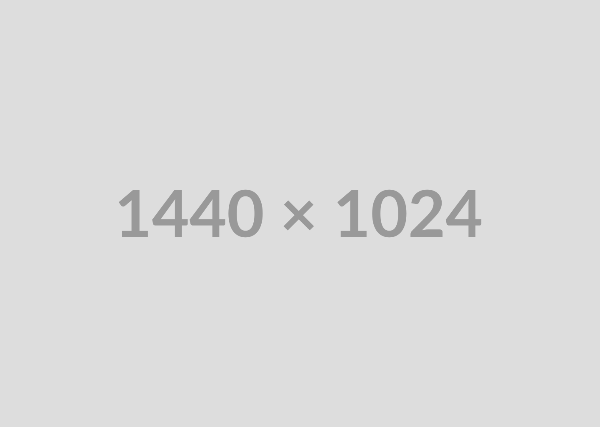

<!-- Implementation -->


> Using the wireframes and mockups as a guide, we implemented the Coffee Express app with the following features:

| Login screen                                                                     | Register screen |
| -------------------------------------------------------------------------------- | --------------- |
|  |

> | medical History                                                                          | Profile                                                                              |
> | ---------------------------------------------------------------------------------------- | ------------------------------------------------------------------------------------ |
> |  |  |

> | Pateint Dashboard                                                                   |
> | ----------------------------------------------------------------------------------- |
> |  |

> | medical History                                                                             | Patient Dashboard                                                                |
> | ------------------------------------------------------------------------------------------- | -------------------------------------------------------------------------------- |
> |  |  |

> | medical History                                                                              | Patient Dashboard                                                                 |
> | -------------------------------------------------------------------------------------------- | --------------------------------------------------------------------------------- |
> |  |  |

> | Vitals                                                                                      | Doctor Profile                                                                         |
> | ------------------------------------------------------------------------------------------- | -------------------------------------------------------------------------------------- |
> |  |  |


<br><br>

<!-- project philosophy -->


> A mobile app for ordering coffee on-the-go, making it easier for coffee lovers to get their favorite beverages without waiting in line.
>
> Coffee Express aims to streamline the coffee-ordering process by providing a user-friendly platform for customers to place orders and pick up their coffee at their convenience. We believe in enhancing the coffee experience by saving time and ensuring customer satisfaction.

### User Stories

- As a patient, I want to choose a doctor and enter my symptoms to a chatbot so that the doctor can check my symptoms later.
- As a user, I want to customize my order, so I can add or remove ingredients according to my preferences.
- As a patient, I want to input my vitals and receive notifications assessing my progress so that I can stay on track with my health goals.

- As a doctor, I want to receive a diagnosis and treatment plan so that I can provide medical advice to my patient.
- As a doctor, I want to conduct virtual consultations through live chat with the patient if needed.
- As a doctor, I want to view my patients along their vitals and detailed medical history.

<br><br>

<!-- Prototyping -->


> We designed Coffee Express using wireframes and mockups, iterating on the design until we reached the ideal layout for easy navigation and a seamless user experience.

### Wireframes

| Login screen                            | Register screen                       | Landing screen                        |
| --------------------------------------- | ------------------------------------- | ------------------------------------- |
|  |  |  |

### Mockups

| Home screen                             | Menu Screen                           | Order Screen                          |
| --------------------------------------- | ------------------------------------- | ------------------------------------- |
|  |  |  |

<br><br>

<!-- Implementation -->


> Using the wireframes and mockups as a guide, we implemented the Coffee Express app with the following features:

### User Screens (Mobile)

| Login screen                              | Register screen                         | Landing screen                          | Loading screen                          |
| ----------------------------------------- | --------------------------------------- | --------------------------------------- | --------------------------------------- |
|  |  |  |  |
| Home screen                               | Menu Screen                             | Order Screen                            | Checkout Screen                         |
|  |  |  |  |

### Admin Screens (Web)

| Login screen                            | Register screen                       | Landing screen                        |
| --------------------------------------- | ------------------------------------- | ------------------------------------- |
|  |  |  |
| Home screen                             | Menu Screen                           | Order Screen                          |
|  |  |  |

<br><br>

<!-- Tech stack -->


### Coffee Express is built using the following technologies:

- This project uses the [Flutter app development framework](https://flutter.dev/). Flutter is a cross-platform hybrid app development platform which allows us to use a single codebase for apps on mobile, desktop, and the web.
- For persistent storage (database), the app uses the [Hive](https://hivedb.dev/) package which allows the app to create a custom storage schema and save it to a local database.
- To send local push notifications, the app uses the [flutter_local_notifications](https://pub.dev/packages/flutter_local_notifications) package which supports Android, iOS, and macOS.
  - 🚨 Currently, notifications aren't working on macOS. This is a known issue that we are working to resolve!
- The app uses the font ["Work Sans"](https://fonts.google.com/specimen/Work+Sans) as its main font, and the design of the app adheres to the material design guidelines.

<br><br>

<!-- How to run -->


> To set up Coffee Express locally, follow these steps:

### Prerequisites

This is an example of how to list things you need to use the software and how to install them.

- npm
  ```sh
  npm install npm@latest -g
  ```

### Installation

_Below is an example of how you can instruct your audience on installing and setting up your app. This template doesn't rely on any external dependencies or services._

1. Get a free API Key at [https://example.com](https://example.com)
2. Clone the repo
   ```sh
   git clone https://github.com/your_username_/Project-Name.git
   ```
3. Install NPM packages
   ```sh
   npm install
   ```
4. Enter your API in `config.js`
   ```js
   const API_KEY = "ENTER YOUR API";
   ```

Now, you should be able to run Coffee Express locally and explore its features.
